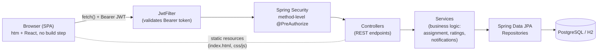

# RoadFix (RoadsideGarage)

A full-stack, role-based roadside assistance and garage-booking platform. Customers describe a vehicle fault, get matched to a nearby garage, and get a technician auto-assigned — end to end, with live status tracking and ratings.

**Live demo:** https://roadsidegarage.onrender.com
**Stack:** Java 21 · Spring Boot 3.5 · Spring Security (JWT) · Spring Data JPA · PostgreSQL (H2 for local dev) · Vanilla JS (htm + React) · Docker

---

## Table of contents

- [Overview](#overview)
- [Tech stack](#tech-stack)
- [Architecture](#architecture)
- [Roles & features](#roles--features)
- [REST API reference](#rest-api-reference)
- [Database schema](#database-schema)
- [Notification system](#notification-system)
- [Project structure](#project-structure)
- [Getting started](#getting-started)
- [Environment variables](#environment-variables)
- [Deployment](#deployment)
- [Known limitations](#known-limitations)

---

## Overview

RoadFix has three roles that all share one login system:

| Role | Can do |
|---|---|
| **Customer** (`ROLE_USER`) | Register vehicles, describe a fault, find/book a garage, track the job, rate it |
| **Garage Owner** (`ROLE_GARAGE_OWNER`) | Create garages, set prices, manage technicians, track bookings, view leaderboard |
| **Technician** (`ROLE_GARAGE_MEMBER`) | Join a garage, accept/complete assigned jobs, toggle availability |

The backend is a single Spring Boot service exposing a JSON REST API; the frontend is a dependency-free single-page app (no build step) served directly from Spring Boot's static resources.

---

## Tech stack

**Backend**
- Java 21, Spring Boot 3.5.9
- Spring Web (REST controllers)
- Spring Data JPA / Hibernate (ORM)
- Spring Security + JJWT (stateless JWT auth)
- Bean Validation (`spring-boot-starter-validation`)
- PostgreSQL driver (production) / H2 (local dev, in-memory)
- OpenAI API via Spring's `RestClient` (optional AI fault classification)
- Lombok

**Frontend**
- No framework build step — ES modules loaded directly by the browser
- [`htm`](https://github.com/developit/htm) + React (via `esm.sh` CDN imports) for JSX-like templating without a compiler
- Plain CSS with custom properties (light/dark theme support)
- `fetch`-based API client with JWT bearer auth

**Infra**
- Multi-stage `Dockerfile` (Maven build → JRE runtime image)
- Deployed on Render (web service + managed Postgres)

---

## Architecture

### Request flow



### Layering

- **Controller** — thin HTTP layer. Validates input (`@Valid` + DTOs), delegates to services, never trusts client-supplied user IDs (always resolves the acting user from the JWT via `CurrentUserService`).
- **Service** — business logic: `BookingService` (placement/cancellation), `AssignmentService` (auto-assign best technician), `JobService` (accept/complete/rate), `NotificationService` (writes notifications), `LeaderboardService` (monthly ranking), `FaultClassificationService` (OpenAI integration).
- **Repository** — Spring Data JPA interfaces, one per entity, no custom SQL beyond derived query methods.
- **Model** — JPA entities (see [Database schema](#database-schema)).
- **DTOs** — every request/response body has a dedicated DTO class; entities are never bound directly to incoming JSON.
- **Security** — a custom `JwtFilter` runs once per request ahead of Spring Security's chain, extracts and validates the JWT, and populates the `SecurityContext`. Authorization is enforced with `@PreAuthorize("hasAuthority('ROLE_...')")` on individual endpoints (method-level security), not just URL patterns. Sessions are stateless (`SessionCreationPolicy.STATELESS`) — no server-side session state, matching the JWT model.

### Frontend architecture

The static frontend (`src/main/resources/static/js/`) is a small SPA with no bundler:

- `main.js` — mounts the app, applies the saved theme.
- `App.js` — hash-based router mapping paths to page components, gated by role (`PROTECTED_ROUTES`).
- `auth.js` — session state (React context), role resolution, JWT storage in `localStorage`.
- `api.js` — thin `fetch` wrapper: attaches the bearer token, normalizes errors, handles 401s (except on `/auth/*`, so login failures show the real error instead of a false "session expired").
- `pages/` — one file per screen, organized by role folder (`customer/`, `owner/`, `technician/`).
- `components/` — shared UI (`Layout`, `TopBar`, `BottomNav`, `Button`, `StatusBadge`, etc.).

---

## Roles & features

### 🔐 Auth & account (all roles)
- Register (choose a role), login (JWT), logout
- Profile: view/edit email, phone, nationality, residential address
- Day/night theme toggle (persisted)
- Notifications: unread badge (polled every 15s), list, mark read/all read

### 🚗 Customer
- Describe an issue in free text + **AI-suggested fault type** (OpenAI, optional)
- Icon-based fault-type and vehicle pickers
- Location via GPS or typed address (geocoded client-side via OpenStreetMap Nominatim), remembers last location
- Live "N garages within X km" badge before searching
- Search radius control
- Active-booking banner (avoids duplicate searches while a job is in progress)
- "Book again" one-tap rebook from the last completed job
- SOS shortcut — instant widest-radius search using current GPS location
- Nearby garage search sorted by distance, with fault×vehicle-specific pricing and ratings
- Place a booking — the backend **auto-assigns the best available technician** by rating (falls back to "unassigned" if none free)
- Booking history with live status, cancel option, technician contact info
- Rate a completed job (stars + comment)
- Vehicle management (add/list vehicles)

### 🏠 Garage Owner
- Create garages (location, daily capacity)
- Set prices per fault-type × vehicle-type combination
- View/manage technician roster (technicians self-join — see below)
- View all bookings for a garage; manually assign a technician or retry auto-assignment for unassigned bookings; cancel bookings
- Monthly "Employee of the Month" leaderboard by average rating
- Read-only roster of every registered user on the platform (owner-only)

### 🔧 Technician
- **Self-service garage join** — browse garages and join one directly (no owner action required)
- View assigned jobs with customer contact info
- Accept a job (Assigned → In Progress) and mark it complete (→ Completed)
- Toggle availability (online/offline for new assignments)

---

## REST API reference

All endpoints except `/auth/**` and static assets require `Authorization: Bearer <jwt>`. Role restrictions are enforced with method-level `@PreAuthorize`.

### Auth — `/auth` *(public)*
| Method | Path | Description |
|---|---|---|
| POST | `/auth/register` | Create an account with one or more roles |
| POST | `/auth/login` | Authenticate, returns JWT + role list |

### Users — `/api/users`
| Method | Path | Role | Description |
|---|---|---|---|
| GET | `/api/users/me` | any | Current user's profile |
| PUT | `/api/users/me` | any | Update email/phone/nationality/address |
| GET | `/api/users` | Owner | List every registered user (read-only roster) |

### Garages — `/api/garages`
| Method | Path | Role | Description |
|---|---|---|---|
| POST | `/api/garages` | Owner | Create a garage |
| GET | `/api/garages` | any | List all garages |
| GET | `/api/garages/my` | Owner | Owner's own garages |
| GET | `/api/garages/nearby` | any | Haversine distance search; adds price when `faultTypeId` + `vehicleTypeId` given |

### Prices — `/api/garages/{garageId}/prices`
| Method | Path | Role | Description |
|---|---|---|---|
| GET | `/api/garages/{id}/prices` | any | List prices for a garage |
| POST | `/api/garages/{id}/prices` | Owner (own garage) | Set/update a fault×vehicle price |

### Fault types / Vehicle types
| Method | Path | Role | Description |
|---|---|---|---|
| GET / POST | `/api/fault-types` | any / Owner | List / create fault types |
| GET / POST | `/api/vehicle-types` | any / Owner | List / create vehicle types |

### Vehicles — `/api/vehicles`
| Method | Path | Role | Description |
|---|---|---|---|
| POST | `/api/vehicles` | Customer | Register a vehicle |
| GET | `/api/vehicles/my` | Customer | List own vehicles |

### Bookings — `/api/bookings`
| Method | Path | Role | Description |
|---|---|---|---|
| POST | `/api/bookings/place` | Customer | Create a booking; triggers auto-assignment |
| GET | `/api/bookings/my` | Customer | Own booking history |
| GET | `/api/bookings/garage/{id}` | Owner (own garage) | Bookings for a garage |
| PATCH | `/api/bookings/{id}/cancel` | Customer or Owner | Cancel a booking |
| PATCH | `/api/bookings/{id}/reassign` | Owner | Retry auto-assignment for an unassigned booking |
| PATCH | `/api/bookings/{id}/assign?technicianId=` | Owner | Manually assign a specific technician |
| POST | `/api/bookings/{id}/rate` | Customer | Rate a completed job |

### Jobs — `/api/jobs` *(Technician)*
| Method | Path | Description |
|---|---|---|
| GET | `/api/jobs/assigned` | List jobs assigned to the current technician |
| PATCH | `/api/jobs/{id}/accept` | Assigned → In Progress |
| PATCH | `/api/jobs/{id}/complete` | In Progress → Completed |

### Garage members (technicians) — `/api/garage-members`
| Method | Path | Role | Description |
|---|---|---|---|
| POST | `/api/garage-members` | Owner | Add an existing technician account to a garage |
| POST | `/api/garage-members/join` | Technician | **Self-service**: join a garage |
| GET | `/api/garage-members/available-technicians` | Owner | Technicians not yet linked to any garage |
| GET | `/api/garage-members/garage/{id}` | Owner/Technician | Roster for a garage |
| GET | `/api/garage-members/me` | Technician | Own technician profile |
| PATCH | `/api/garage-members/me/availability?available=` | Technician | Toggle online/offline |

### Leaderboard — `/api/garages/{garageId}/leaderboard`
| Method | Path | Description |
|---|---|---|
| GET | `/api/garages/{id}/leaderboard` | Monthly "Employee of the Month" ranking by avg rating |

### Notifications — `/api/notifications`
| Method | Path | Description |
|---|---|---|
| GET | `/api/notifications` | List own notifications |
| GET | `/api/notifications/unread-count` | Unread count (polled by the UI) |
| PATCH | `/api/notifications/{id}/read` | Mark one as read |
| PATCH | `/api/notifications/read-all` | Mark all as read |

### AI — `/api/ai` *(Customer, optional — requires `OPENAI_API_KEY`)*
| Method | Path | Description |
|---|---|---|
| POST | `/api/ai/classify-fault` | Free-text description → suggested fault type + urgency + explanation |

---

## Database schema

```mermaid
erDiagram
    USERS ||--o{ USER_ROLES : has
    ROLES ||--o{ USER_ROLES : "assigned to"
    USERS ||--o{ VEHICLES : owns
    USERS ||--o{ GARAGES : owns
    USERS ||--o| GARAGE_MEMBERS : "is (technician)"
    GARAGES ||--o{ GARAGE_MEMBERS : employs
    GARAGES ||--o{ GARAGE_SERVICE_PRICES : prices
    FAULT_TYPES ||--o{ GARAGE_SERVICE_PRICES : "priced for"
    VEHICLE_TYPES ||--o{ GARAGE_SERVICE_PRICES : "priced for"
    VEHICLE_TYPES ||--o{ VEHICLES : classifies
    GARAGES ||--o{ BOOKINGS : receives
    VEHICLES ||--o{ BOOKINGS : "booked for"
    FAULT_TYPES ||--o{ BOOKINGS : "fault of"
    GARAGE_MEMBERS ||--o{ BOOKINGS : "assigned to"
    USERS ||--o{ BOOKINGS : places
    USERS ||--o{ NOTIFICATIONS : receives
    BOOKINGS ||--o{ NOTIFICATIONS : "triggers (optional)"

    USERS {
        Long id PK
        string username UK
        string email UK
        string password "bcrypt hash"
        string phone
        string nationality
        string residentialAddress
        boolean enabled
    }
    ROLES {
        Long id PK
        string name UK "ROLE_USER / ROLE_GARAGE_OWNER / ROLE_GARAGE_MEMBER"
    }
    GARAGES {
        Long id PK
        Long ownerUserId FK
        string name
        string address
        double latitude
        double longitude
        int dailyCapacity
        double rating
        int ratingCount
    }
    GARAGE_MEMBERS {
        Long id PK
        Long garageId FK
        Long userId FK_UK "one technician = one garage, ever"
        double latitude
        double longitude
        boolean available
        int activeJobs
        double rating
        int ratingCount
    }
    VEHICLES {
        Long id PK
        Long userId FK
        Long vehicleTypeId FK
        string model
        int manufactureYear
        string licensePlate
    }
    VEHICLE_TYPES {
        Long id PK
        string name UK "SEDAN / SUV / HATCHBACK / BIKE / TRUCK"
    }
    FAULT_TYPES {
        Long id PK
        string name UK "BATTERY_ISSUE / FLAT_TYRE / BRAKE_PROBLEM / ..."
        string description
    }
    GARAGE_SERVICE_PRICES {
        Long id PK
        Long garageId FK
        Long faultTypeId FK
        Long vehicleTypeId FK
        double price
    }
    BOOKINGS {
        Long id PK
        Long userId FK
        Long garageId FK
        Long vehicleId FK
        Long faultTypeId FK
        Long assignedMemberId FK "nullable"
        date appointmentDate
        string status "PENDING/UNASSIGNED/ASSIGNED/IN_PROGRESS/COMPLETED/RATED/CANCELLED"
        double quotedPrice
        string serviceAddress
        double serviceLatitude
        double serviceLongitude
        int rating "1-5, nullable"
        string ratingComment
        datetime createdAt
        datetime completedAt
        datetime ratedAt
    }
    NOTIFICATIONS {
        Long id PK
        Long userId FK
        string message
        Long bookingId FK "nullable"
        boolean read
        datetime createdAt
    }
```

**Notes:**
- `USER_ROLES` is an implicit join table (`@ManyToMany` between `User` and `Role`) — a user can hold multiple roles, though the app's registration flow only assigns one.
- `garage_members.user_id` has a **unique constraint** — a technician account can belong to at most one garage, ever. This is what makes the self-join flow safe (no re-join races).
- `garage_service_prices` has a composite unique constraint on `(garage_id, fault_type_id, vehicle_type_id)` — one price per combination per garage.
- Schema is managed by Hibernate (`spring.jpa.hibernate.ddl-auto=update`) — no migration tool (Flyway/Liquibase) is in use; tables are created/updated automatically from the entity classes on startup.

---

## Notification system

Notifications are written synchronously (inline, same request thread) by `NotificationService`, triggered at these points:

| Trigger | Recipient(s) |
|---|---|
| Booking placed, no technician available | Customer + garage owner |
| Technician assigned (auto, reassigned, or manual) | Customer + technician |
| Booking cancelled by the garage owner | Customer |
| Booking cancelled by the customer (already assigned) | Technician |
| Technician accepts the job | Customer |
| Job marked complete | Customer (prompted to rate) |
| Job rated | Technician |

The frontend polls `/api/notifications/unread-count` every 15 seconds — there's no WebSocket/SSE push, so there's up to a 15s delay before a new notification's badge appears.

---

## Project structure

```
src/main/java/com/example/Garage/
├── Controller/       REST endpoints (thin, delegates to services)
├── Dto/              Request/response bodies (never bind entities directly)
├── Model/            JPA entities
├── Repository/       Spring Data JPA interfaces
├── service/           Business logic (assignment, jobs, notifications, ratings, AI)
├── security/         JwtFilter, JwtUtils, SecurityConfig, CustomUserDetailsService
└── exception/        Custom exceptions + @ControllerAdvice global handler

src/main/resources/
├── application.properties
└── static/
    ├── index.html
    ├── css/styles.css
    └── js/
        ├── main.js, App.js, auth.js, api.js, router.js, theme.js
        ├── components/       Shared UI (Layout, TopBar, BottomNav, Button, ...)
        └── pages/
            ├── Login.js, Register.js, Profile.js, Notifications.js
            ├── customer/      Home, GarageResults, MyBookings, Vehicles, RateBooking
            ├── owner/         MyGarages, CreateGarage, GarageDetail + tabs/
            └── technician/    MyJobs
```

---

## Getting started

**Prerequisites:** JDK 21, Maven (or use the bundled `./mvnw`)

```bash
git clone https://github.com/dhakas9360/Roadsidegarage.git
cd Roadsidegarage
./mvnw spring-boot:run
```

The app starts on `http://localhost:8080` using an **in-memory H2 database** by default — no setup needed, but all data is wiped on every restart. The H2 console is available at `/h2-console` (JDBC URL: `jdbc:h2:mem:garage`).

Register an account from the UI, or via curl:

```bash
curl -X POST http://localhost:8080/auth/register \
  -H "Content-Type: application/json" \
  -d '{"username":"cust1","email":"cust1@example.com","password":"pass123","phone":"+919876543210","roles":["ROLE_USER"]}'
```

---

## Environment variables

None are required for local dev — all fall back to safe defaults for H2. For production:

| Variable | Purpose | Default |
|---|---|---|
| `PORT` | Server port | `8080` |
| `JWT_SECRET` | Signing key for JWTs — **set a real one in production** | dev placeholder |
| `SPRING_DATASOURCE_URL` | JDBC URL, e.g. `jdbc:postgresql://host:5432/db` | H2 in-memory |
| `SPRING_DATASOURCE_USERNAME` | DB username | `sa` |
| `SPRING_DATASOURCE_PASSWORD` | DB password | *(empty)* |
| `SPRING_DATASOURCE_DRIVER` | JDBC driver class, e.g. `org.postgresql.Driver` | `org.h2.Driver` |
| `H2_CONSOLE_ENABLED` | Set `false` in production | `true` |
| `OPENAI_API_KEY` | Enables the AI fault-classification feature (optional) | *(unset — feature disabled)* |

---

## Deployment

The included `Dockerfile` is a multi-stage build (Maven build stage → slim JRE runtime) and works on any container host. Currently deployed on **Render**:

1. Web service builds from the `Dockerfile`.
2. A managed Render **PostgreSQL** instance provides persistence (see env vars above).
3. Free-tier caveats: the web service spins down after inactivity (first request after idle takes ~50s+ to wake), and Render's free Postgres tier is time-limited.

---

## Known limitations

- **Fully synchronous backend** — no `@Async`, scheduled jobs, or message queues. Booking placement, technician assignment, and notification writes all happen inline in one request. The OpenAI call is a blocking HTTP request, so a slow AI response holds a server thread.
- **No real-time push** — notifications and job status updates rely on 15s polling, not WebSockets/SSE.
- **No migration tool** — schema changes rely on Hibernate's `ddl-auto=update`, which is fine for a demo but not how you'd manage a production schema long-term.
- **No automated tests** currently included beyond the Spring Boot test scaffolding.
